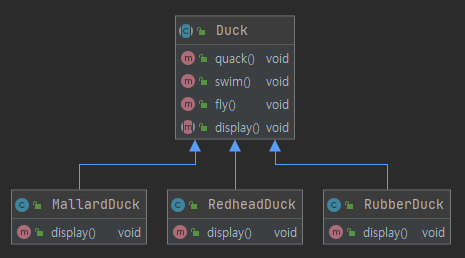
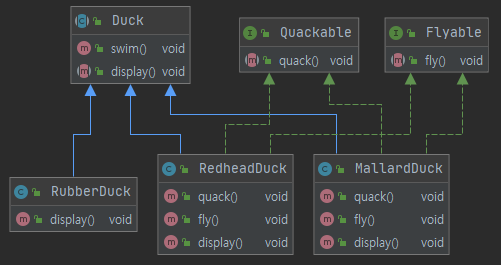
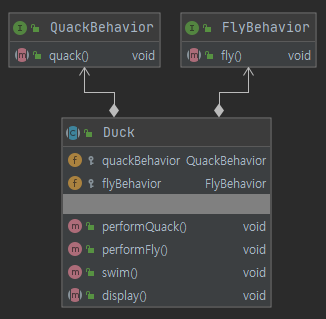
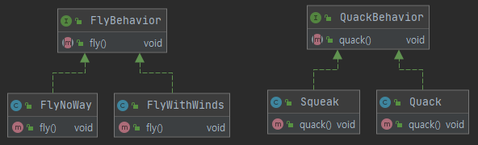

# 전략 패턴

## 오리 시뮬레이션 게임

### 1. 날 수 있는 기능 추가

#### 1.1. 상속을 통한 해결



Duck 이라는 추상 클래스를 통해 모든 오리를 관리하고 있다.
오리의 특징인 꽥꽥 소리를 내는 "quack()", 물에서 수영할 수 있는 "swim()" 메서드가 존재한다.
"display()"는 Duck 상속받은 각 오리 클래스가 화면에 표시되는 기능을 한다.
추가적인 요구사항을 통해 이제 오리는 날아야 한다.
이를 해결하기 위해 Duck 추상 클래스에 "fly()"를 추가한다.

```java
public abstract class Duck {

    // 꽥꽥!
    public void quack() {
        ...
    }

    // 수영하기
    public void swim() {
        ...
    }

    /**
     * 추가 요구사항 발생, 오리가 하늘을 날아야 한다.
     */
    // 날기
    public void fly() {
        System.out.println("Duck.fly()");
    }

    // 표시
    public abstract void display();

}
```

> 문제점

MallardDuck(청둥 오리), RedheadDuck(큰흰죽지) 의 경우 실제 "fly()" 메서드가 필요하다.
그러나 RubberDuck(고무 오리)는 날지 못한다.
Duck 추상 클래스에 "fly()"를 추가를 통해 RubberDuck(고무 오리)도 강제적으로 "fly()" 가능해졌다.

```java
// 나는 고무라서 날수가 없는데..
public class RubberDuck extends Duck {

    @Override
    public void display() {
        System.out.println("(Duck > RubberDuck).display()");
    }

}
```

결론적으로 코드의 재사용성이라는 측면에서는 장점이나 서브 클래스에 불필요한 영향을 줄 수 있다.


```java
// 나는 고무라서 날수가 없는데..
public class RubberDuck extends Duck {

    @Override
    public void fly() {
        // 아무것도 하지 않는다..
    }

    ...

}
```

물론 아무것도 하지 않도록 오버라이드를 할수 있다. 그러나 많은 서브 클래스가 있다면 쉽지 않다.

#### 1.2. 인터페이스를 통한 해결



"fly()" 를 Duck 클래스에서 분리하여 Flyable 인터페이스에 작성했다.
추가적으로 "quack()" 기능도 Quackable 인터페이스로 분리했다.
상속을 통한 방법과 다르게 필요한 오리 클래스에게 필요한 인터페이스만 구현하도록 코드를 수정한다.

```java
public class MallardDuck extends Duck implements Quackable, Flyable {

    @Override
    public void quack() {
        System.out.println("(Quackable > MallardDuck).quack()");
    }

    @Override
    public void fly() {
        System.out.println("(Flyable > MallardDuck).fly()");
    }

    @Override
    public void display() {
        System.out.println("(Duck > MallardDuck).display()");
    }

}
```

이제는 Duck 클래스를 통해 기능을 상속해서 발생하였던 사이드 이펙트가 발생하지 않도록 작성할 수 있다.

> 문제점

인터페이스를 통한 행위를 분리한 구조는 오리가 필요한 행위만을 구현하도록 해야 한다.
그러나 오리 클래스가 30~40개 이상 존재한다면 각 개별적 오리 클래스서 필요로 하는 인터페이스만을 구현하는 것은 쉽지 않다.
결국 코드 중복이 발생하고 코드의 재사용성이 떨어진다.

#### 1.3. 전략 패턴을 통한 해결



하늘을 나는 행위인 "FlyBehavior", 꽥꽥 소리를 내는 행위인 "QuackBehavior" 로 인터페이스로 분리했다.

```java
public abstract class Duck {

    protected QuackBehavior quackBehavior;
    protected FlyBehavior flyBehavior;

    public void performQuack() {
        quackBehavior.quack(); // 꽥꽥 행동
    }

    public void performFly() {
        flyBehavior.fly(); // 날기 행동
    }

    // 수영하기
    public void swim() {
        System.out.println("Duck.swim()");
    }

    // 표시
    public abstract void display();

}
``` 

두 행위인 "FlyBehavior", "QuackBehavior"는 Duck 클래스에 멤버 변수로 추가되었으며 각 인터페이스가 수행하는 기능을 "performXXX" 메서드로 정의가 되었다.
Duck 클래스는 나는 행위와 꽥꽥 행위를 인터페이스 위임하고 있다.



"FlyBehavior", "QuackBehavior"는 행위에 대한 인터페이스이며 구체적인 실제 행위는 서브 클래스에 구현이 되어 있다. 

```java
public class MallardDuck extends Duck {

    public MallardDuck() {
        flyBehavior = new FlyWithWinds();
        quackBehavior = new Quack();
    }

    @Override
    public void display() {
        System.out.println("(Duck > MallardDuck).display()");
    }

}
```

Duck 클래스를 상속받은 MallardDuck 클래스를 보면 생성자를 통해 행위에 대한 구체적인 정의가 이루어지고 있다.
특정 구현에 맞춰서 프로그래밍을 하면 좋지 않지만 현재 여기서는 프로그램 실행 시에 쉽게 변경이 가능하다.

```java
public abstract class Duck {

    protected QuackBehavior quackBehavior;
    protected FlyBehavior flyBehavior;

    // 설정을 위한 Setter 메서드
    public void setQuackBehavior(QuackBehavior quackBehavior) {
        this.quackBehavior = quackBehavior;
    }

    // 설정을 위한 Setter 메서드
    public void setFlyBehavior(FlyBehavior flyBehavior) {
        this.flyBehavior = flyBehavior;
    }
    
    ...

}
```

Duck 클래스에 Setter 메서드를 추가하였다. 

```java
public class Main {
    public static void main(String[] args) {
        Duck mallard = new MallardDuck();
        mallard.performFly();
        // 동적으로 fly 행위를 변경
        mallard.setFlyBehavior(new FlyNoWay());
        mallard.performFly();
    }
}
```

이제 Setter 를 통해 프로그램이 실행되면서 동적으로 행위를 변경할 수 있다.
이러한 기능을 모든 Duck 클래스를 상속받은 서브 클래스에게 동적으로 행위를 변경할 수 있다.

"FlyBehavior", "QuackBehavior" 두 클래스는 Duck 클래스와 has-a 관계를 갖고 있다.
즉, '구성'을 이용한 구조이다.
현재 예시에서는 Duck 의 행동을 상속받는 대신, 행위에 대한 부분은 구성으로 부여받고 있디.
구성을 활용하면 시스템 유연성을 크게 향살시킬 수 있다.

# 결론

애플리케이션은 시간이 지남에 따라 변화하고 성장해야 한다. 즉, 변화를 한다.
달라지는 부분을 찾아서 나머지 코드에 영향을 주지 않도록 '캡슐화'합니다.
그러면 코드를 변경하는 과정에서 의도치 않게 발생하는 일을 줄이면서 시스템의 유연성을 향상..